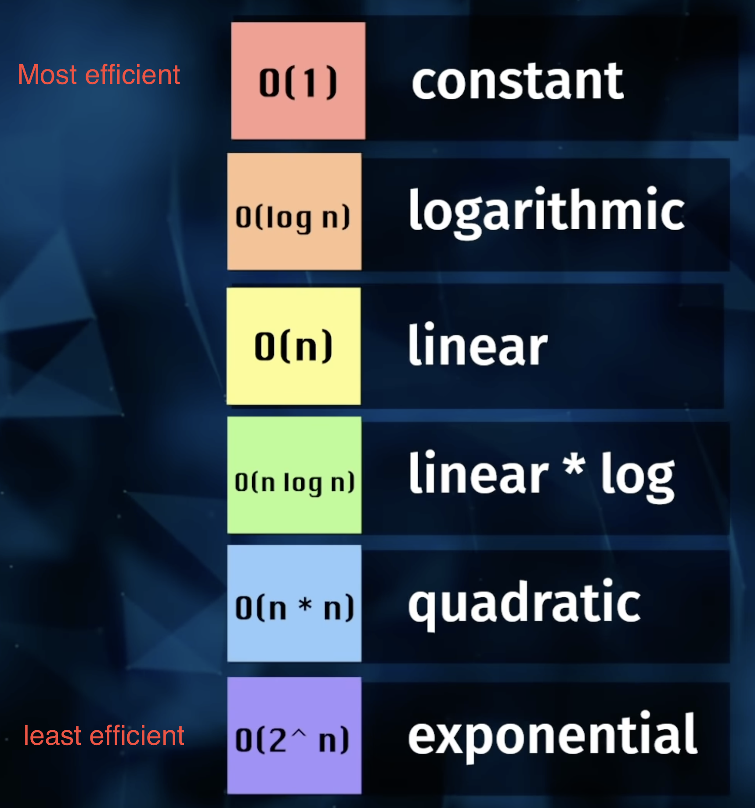
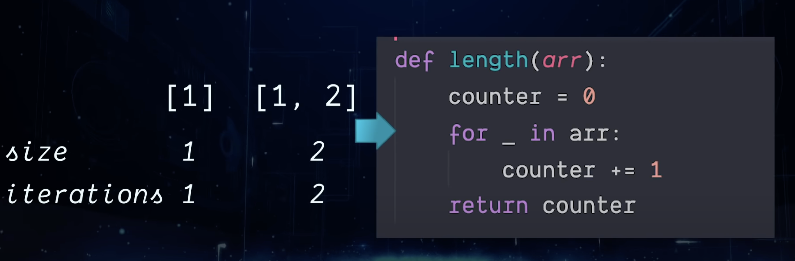
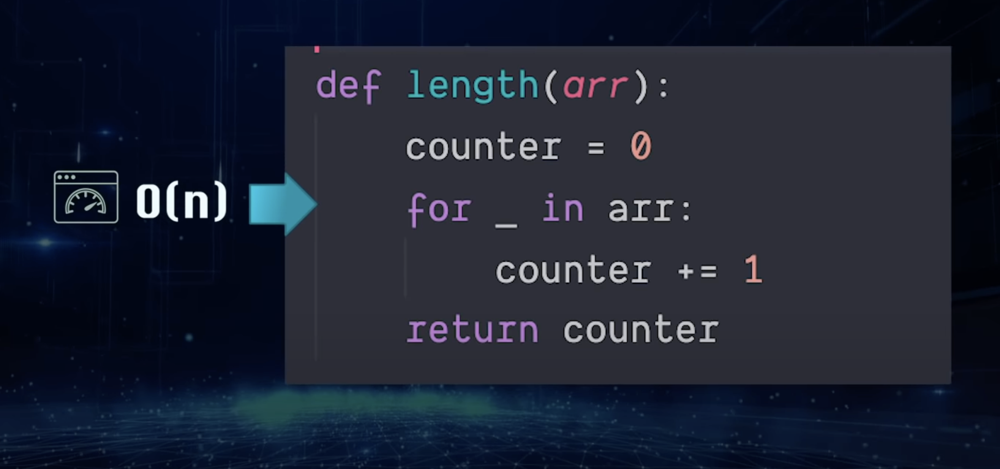

# Implementation: Linked Lists

## Big O: Analysis of Algorithm Efficiency

Big O is used to define the efficiency of your algorithm/function.
Its is defined by running time which is the time is takes to complete your function.
It is also defined by memory space which is the amount of memory required to instructions and data.  
Whatever the worst case of your function is, is the Big O of your function.
It is measure by: Input Size, Units of Measurement, Orders of Growth, Best Case, Worst Case, and Average Case.
If a function uses an array or list as one parameter, then the number of elements within that array or list will directly increase the Input Size of that parameter.
We can describe overall efficiency by using the input size n and measuring the overall Units of Space and Time required for the given input size n. As the value of n grows, the Order of Growth represents the increase in Running Time or Memory Space.

Source: <https://codefellows.github.io/common_curriculum/data_structures_and_algorithms/Code_401/class-05/resources/big_oh.html>

## Big O Diagrams

All visual source: <https://www.youtube.com/watch?v=oJ5s2hs_cKk>

## Linked Lists

A Linked List is a sequence of Nodes that are connected/linked to each other. The most defining feature of a Linked List is that each Node references the next Node in the link.

Linked List - A data structure that contains nodes that links/points to the next node in the list.
Singly - Singly refers to the number of references the node has. A Singly linked list means that there is only one reference, and the reference points to the Next node in a linked list.
Doubly - Doubly refers to there being two (double) references within the node. A Doubly linked list means that there is a reference to both the Next and Previous node.
Node - Nodes are the individual items/links that live in a linked list. Each node contains the data for each link.
Next - Each node contains a property called Next. This property contains the reference to the next node.
Head - The Head is a reference of type Node to the first node in a linked list.
Current - The Current is a reference of type Node to the node that is currently being looked at. When traversing, you create a new Current variable at the Head to guarantee you are starting from the beginning of the linked list.

Source: <https://codefellows.github.io/common_curriculum/data_structures_and_algorithms/Code_401/class-05/resources/singly_linked_list.html>

## REFERENCES

<https://www.youtube.com/watch?v=oJ5s2hs_cKk>

<https://codefellows.github.io/common_curriculum/data_structures_and_algorithms/Code_401/class-05/resources/big_oh.html>
