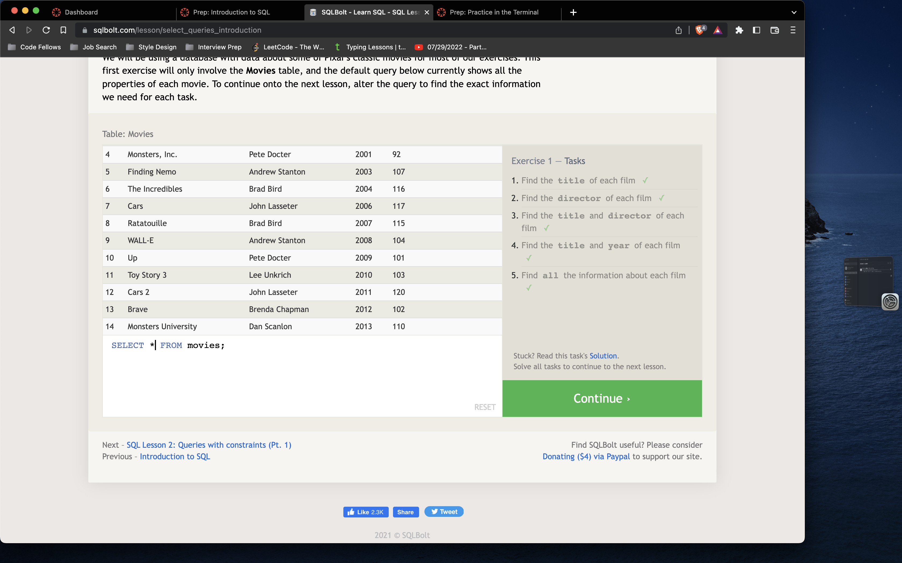
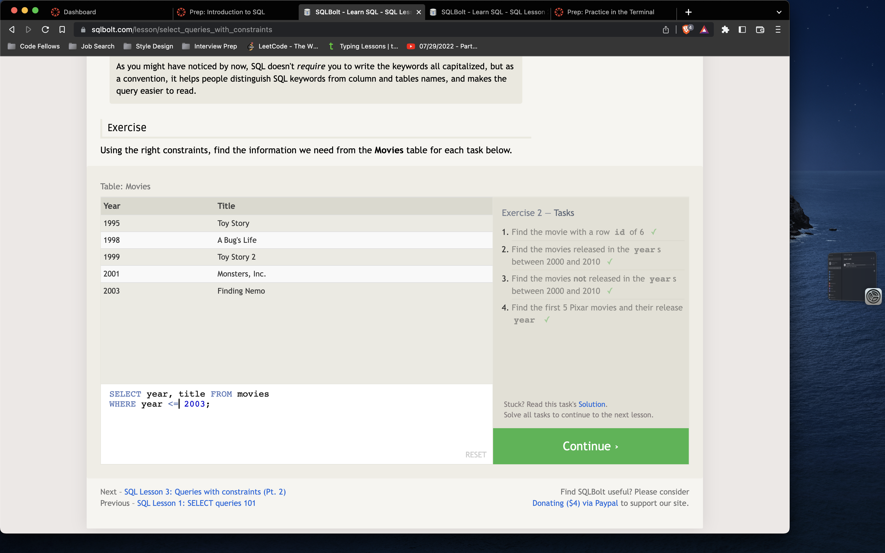
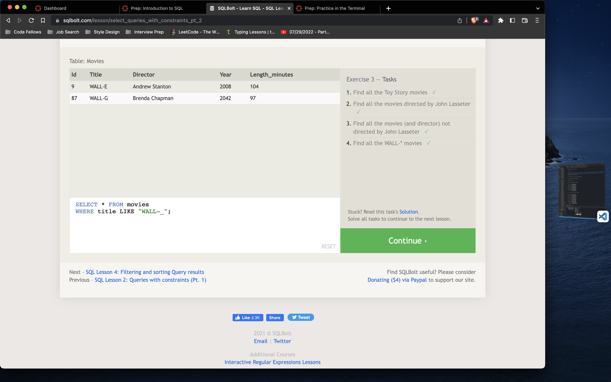
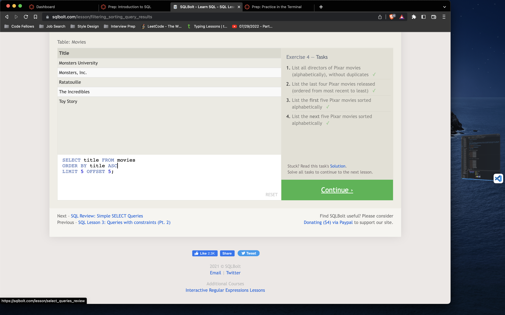
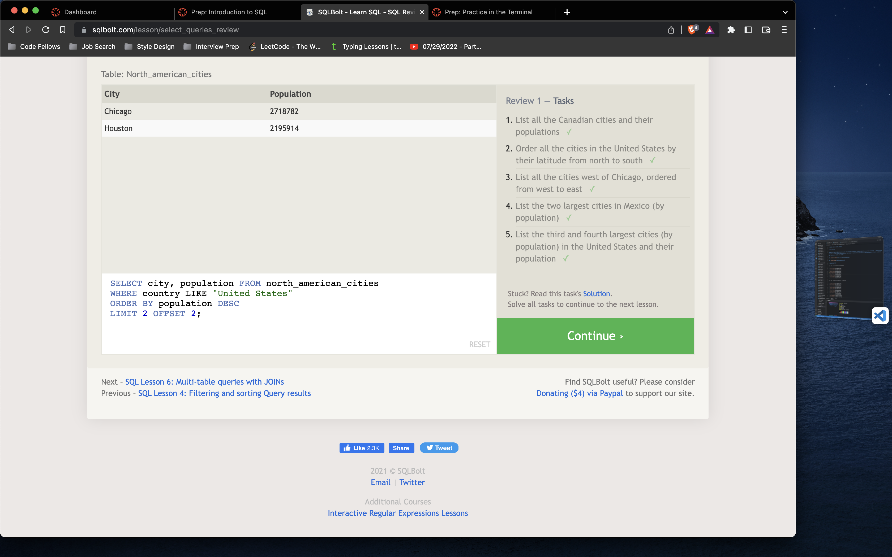
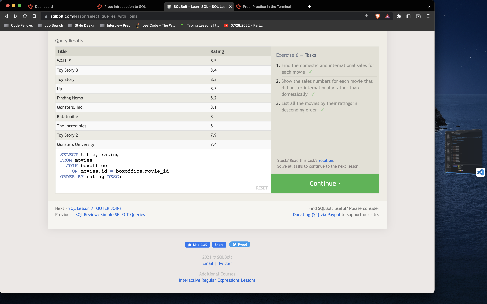
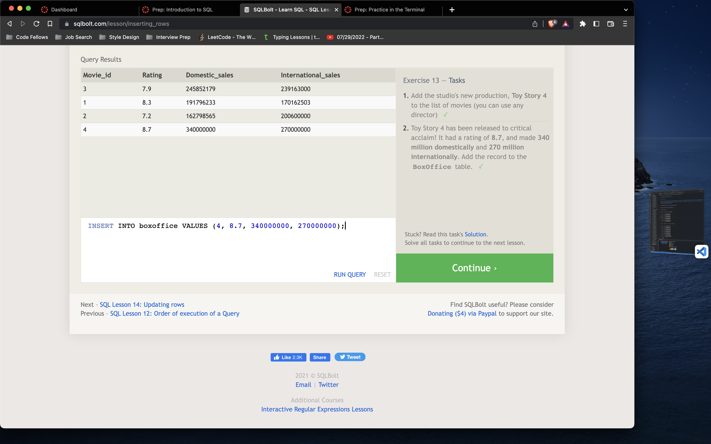
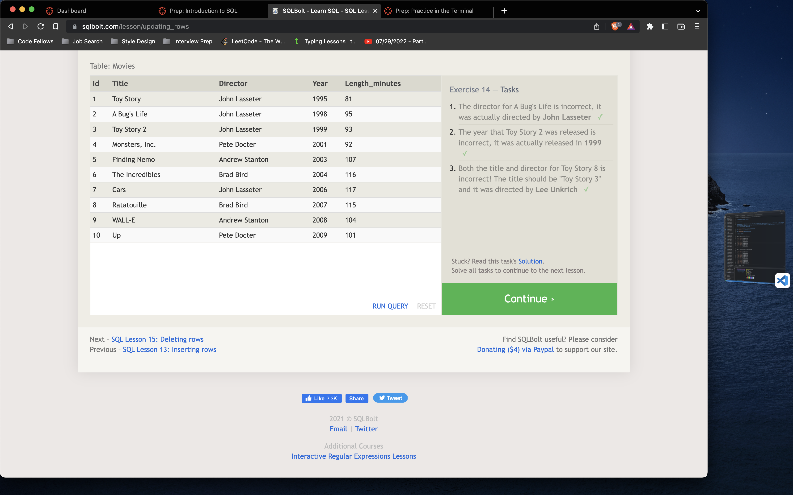
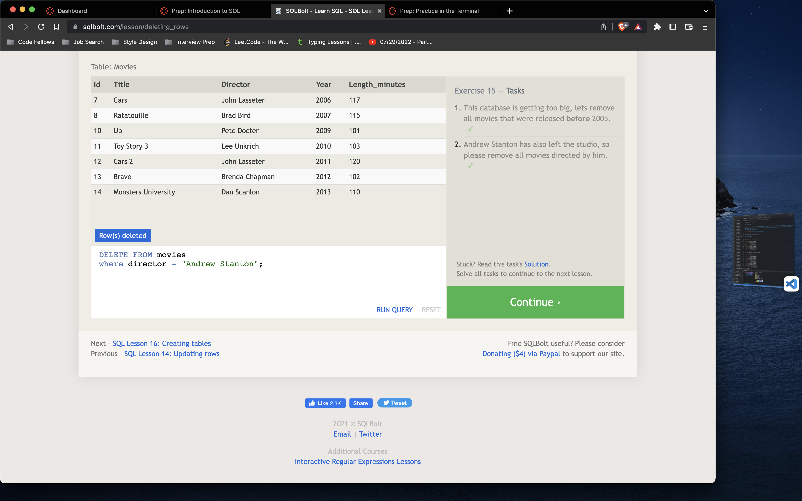
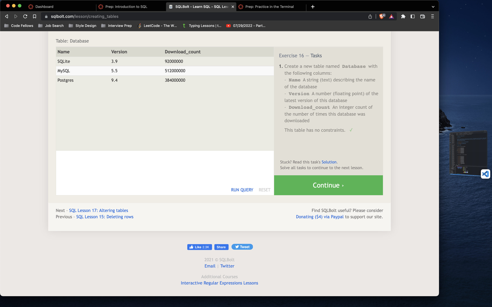

# Introduction to SQL

## SQL

## *My basic understanding of SQL is that is stands for Structured Query language and is used to retrieve information from a databases. I have example of my practice with SQL Below.*

------------------------------------------------------------------------

## Relational Databases

## *I learned that Relational Databases is a collection data-items that are organized as a set of tables with rows and columns. I provided examples of my practice with Relational Databases below.*

# References

<https://landing.chartio.com/download-learn-sql>
<https://sqlbolt.com/>
<https://aws.amazon.com/relational-database/>
